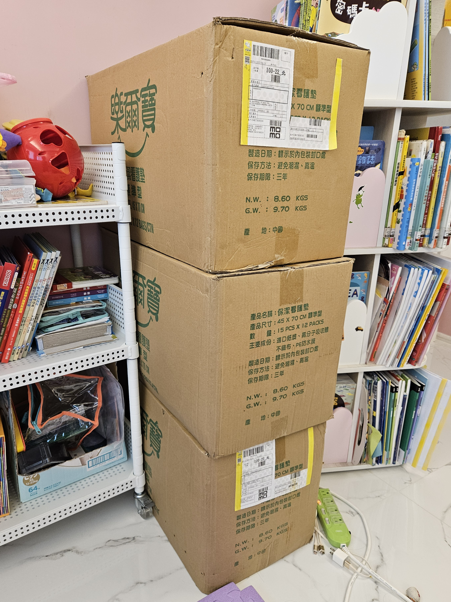

# 用不完的護理用品

去年第一批從長庚買的看護墊用完以後，6/18買了的第二批看護墊。那時買了4箱×每箱12包×每包15片=720片，想法是每天護理要作4次，720片雖然看起來很多，除下來只有180天而已，半年就用完了。

一箱標示9.7公斤，總共接近40公斤又大又重。以往送貨到大樓一樓管理員收件以後，我們都是自己去搬上來的，但是突然出現這麼大量的看護墊，大概看起來就是這戶有人不太妙的樣子，引發了管理員與送貨員的同情心，所以他們破例直接搬到我們家的門口…^^|

只是現在已經七個月過去了，我只用完1箱，第2箱還有4包接近5包… 因為我沒有想到作護理的頻率下降得很快。其實買來以後，我幾乎都只有做到一天3次，一天要找到4次沒那麼痛的空檔，真的很不容易^^| 然後到了八月開始可以一天2次、接近九月的時候開始一天1次，到了十二月第二週開始大約一週4次…(雖然是可以兩天1次了，但是會想去同步不同日子的活動)…

總之，這樣算下來…… 現在的速度大概要一年才會用完一箱，只是看看箱子上面標示的保存期限只有三年…

除了看護墊以外，我6/18買了780個保險套和2000ml的KY，八月初又買了1152個保險套、九月買2700ml的KY… 因為那時我除了一天3次以外，每次依序要用SML共3支棒子，一個月就用超過250個… 只是不但作護理的頻率下降了，十一月以後一次只需要用2支棒子(從L開始)，而最近從 soul source 買了可以不用套套的棒棒 (不用套套反而會比較滑)，從此只有第1支棒子會用到套套… 套套的用量也顯著下降，一千個算起來夠用超過5年…… 我就沒數存貨還剩下多少了w

雪上加霜上的是，上次一月初回診的時候胡醫師說：我預期你們應該一年後就不用再作擴張了！

囧囧
