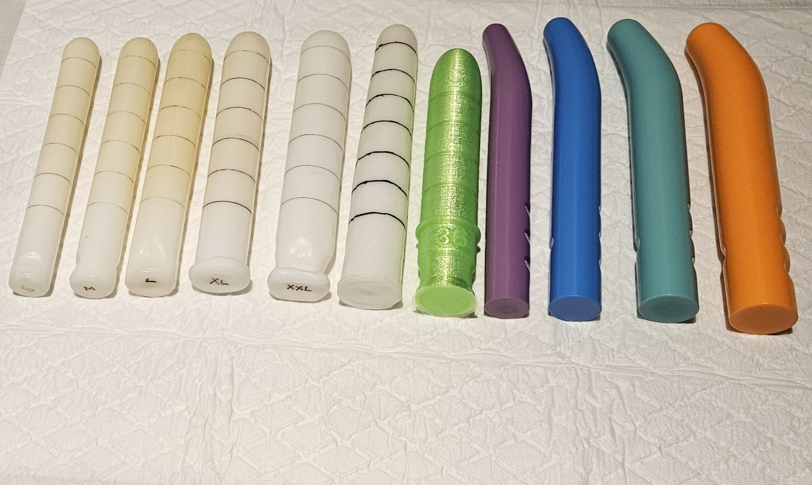

# 好多好多的棒棒

    一支棒棒如果不切掉，仍舊是一支；
    如果切掉了，就生出很多支棒棒來。

出院的時候醫院配給我3支，後來再加購2支。然後又從 Soul Source 買了4支，還有胡醫師捏的1支圓椎形測試棒，和M學姐3D列印的1支彈性測試棒 －－ 我現在總共有11支棒棒

    學姐：你就缺了當初沒3D掃描起來那隻……
    學姐：用自己的ㄐㄐ來擴張自己，聽起來真的超魔幻的
    琳子：奇怪的知識增加了！
    琳子：可惜就沒想到… 啪！沒了……(頓足大哭
    學姐：應該要記得提醒大家術前的注意事項XD
