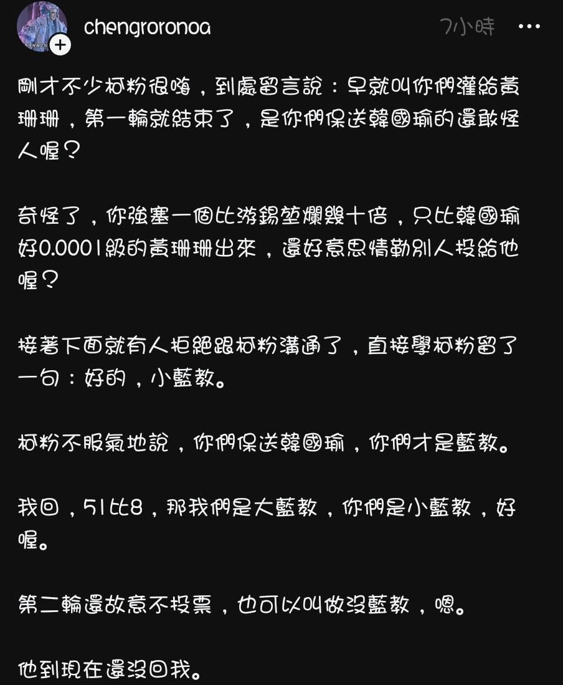

# 沒藍教，好喔

偶爾就會看到這種拿ㄐㄐ當聖杯的文章：

[Threads 文章連結](https://www.threads.net/@chengroronoa/post/C2y8M0NJ68b/)

不知道一般女生看了是什麼樣的感覺。

我雖然可以理解他諧音雙關語想要表達的意思，但是一面也感嘆著，你們捧為聖杯的東西，我費了千辛萬苦才終於擺脫掉……

整個文章不小心都變成反著看了：沒藍教，好喔。
